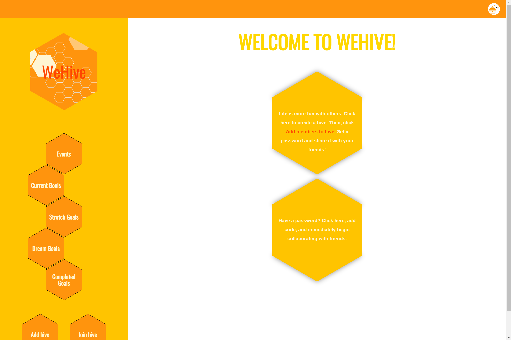
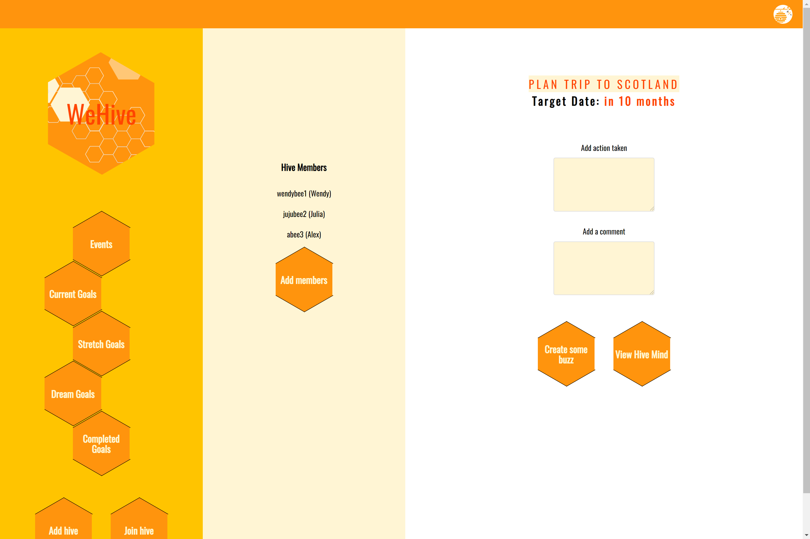
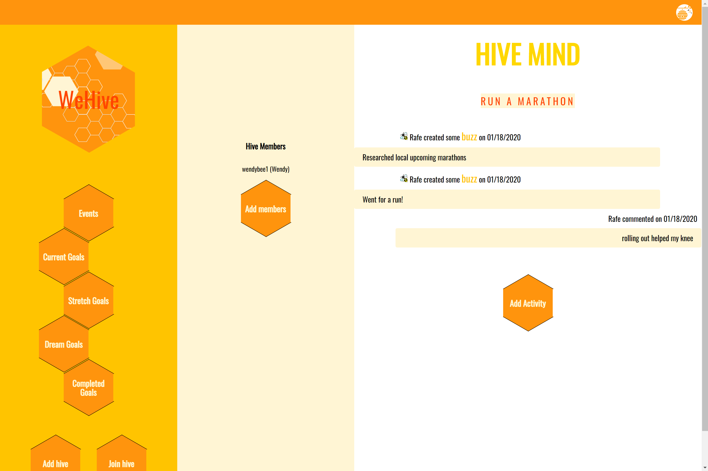

# WeHive

My users will _jive_ together like a _beehive_ using _WeHive_.

Studies show that people who act collaboratively stick to their task 64% longer than those working alone. Groups of people working toward a common goal report higher engagement levels, lower fatigue levels and higher success rates.

Users can use my app to create accountability groups amongst their peers where they can log actions they've taken to make progress on their goals and collaborate with their friends.

Users who wish to create a "hive" can register for an account and add their goals according to its type. e.g. "Current goal" or "Dream goal". The main purpose of the app is to connect users with each other, so the hive creator adds a passcode to the hive and shares it with interested parties. Those users wishing to join that hive will need to create an account and use the passcode to be allowed entry to the hive. There, all users can log activity and comment on the group's progress in the "Hive Mind."

## See it live!

[WeHive Live App](https://wehive.now.sh/)

[WeHive App (GitHub)](https://github.com/thinkful-ei-iguana/we-hive-app/tree/master)

## What to Expect

This is phase 1 of WeHive. Ultimately, users will be able to search for groups of people with common goals and request to join.

Additionally, users will be able to log additional information about their progress, including things like time spent on the activity, satisfaction level with progress, notes about progress, and reminders for future actions. Users will be able to choose to include this information in the Hive Mind. Users will also be able to set short-term goals and milestones within each of their Hive Minds.

## Technology Used

Front-End: _ReactJS | CSS_

Back-End: _NodeJS | KnexJS | ExpressJS | PostgreSQL_

Testing: _Mocha | Chai_

## API Documentation

| Method | Path                         | Purpose                                        |
| ------ | ---------------------------- | ---------------------------------------------- |
| POST   | /api/auth/login              | Authorize login                                |
| POST   | /api/users                   | Create account                                 |
| GET    | /api/hives                   | Display authorized user's hives                |
| GET    | /api/hives/:hive_id          | Return hive with hive_id                       |
| GET    | /api/hives/user              | Provide logged in user's info                  |
| GET    | /api/hives/:hive_id/members  | Provide members belonging to hive with hive_id |
| POST   | /api/hives                   | Create a hive                                  |
| POST   | /api/activity                | Post activity for a hive                       |
| PATCH  | /api/hives/:hive_id/code     | Set a password for hive with hive_id           |
| POST   | /api/hives/code              | Allows user with password to join hive         |
| GET    | /api/hives/:hive_id/activity | Display activity for hive with hive_id         |
